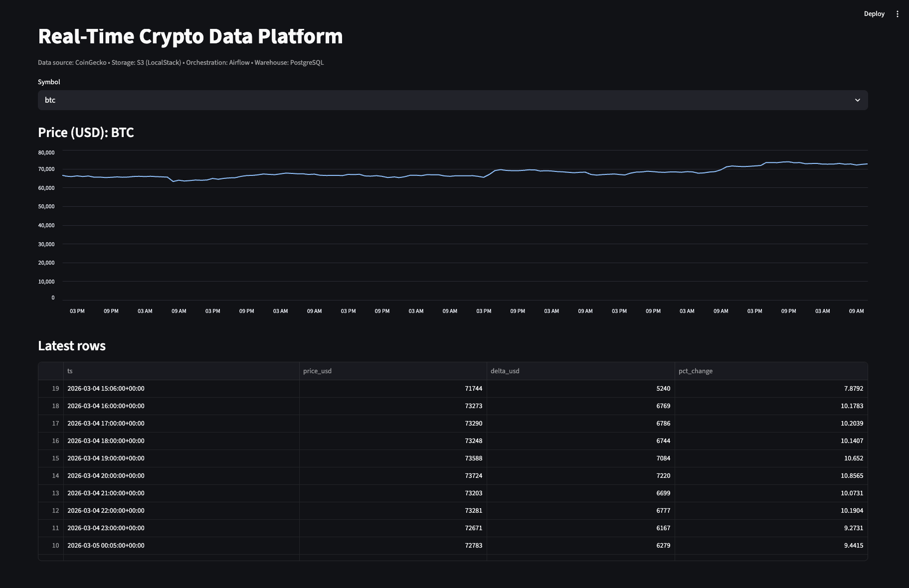
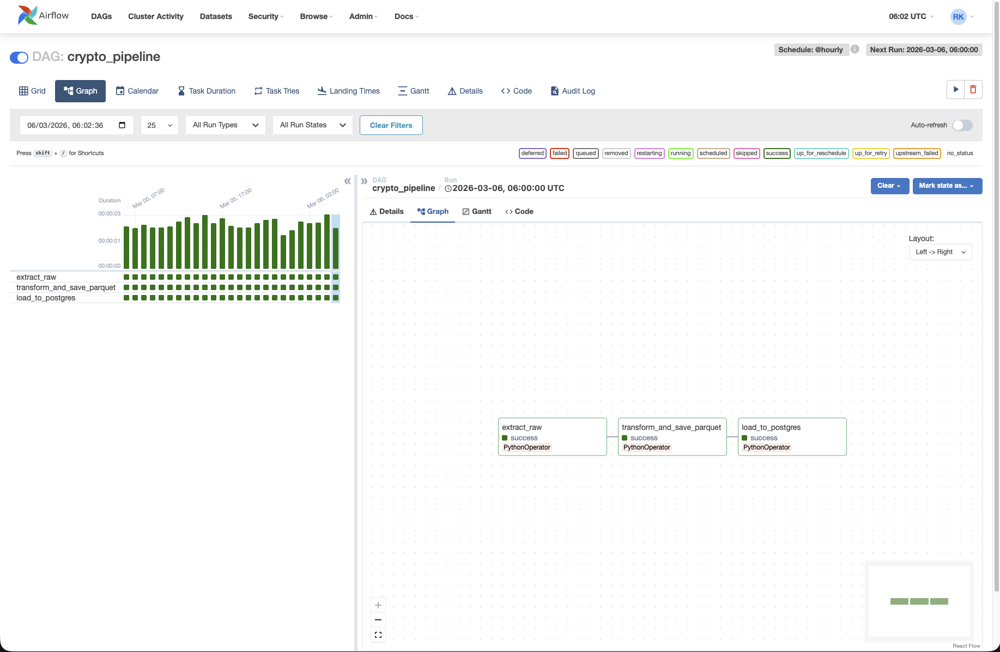

# 🚀 Real-Time Crypto Data Platform

Production-like Data Engineering project (ELT) with a local AWS-like stack.

- **Airflow UI:** http://localhost:8080 (admin / admin)
- **Dashboard (Streamlit):** http://localhost:8501
- **S3 (LocalStack endpoint):** http://localhost:4566
- **Postgres:**
  - Airflow metadata DB: `airflow`
  - Data warehouse DB: `crypto`

---

## Overview

This project implements an end-to-end ELT pipeline:

1. Extract crypto market data from a public API
2. Store **raw JSON** in S3 (LocalStack) — raw zone
3. Transform into a normalized tabular format
4. Store **processed Parquet** in S3 (LocalStack) — processed zone
5. Upsert curated data into PostgreSQL (`crypto` database) — warehouse
6. Visualize data in a Streamlit dashboard

---

## Architecture

```
Public API
  ↓
S3 (LocalStack) — raw/ (JSON)
  ↓
Airflow DAG (orchestration)
  ↓
Transform (pandas)
  ↓
S3 (LocalStack) — processed/ (Parquet)
  ↓
PostgreSQL (crypto DB) — analytics table(s)
  ↓
Streamlit Dashboard
```

---

## Tech Stack

- Python (pandas, boto3, sqlalchemy)
- PostgreSQL
- Apache Airflow
- S3 (LocalStack as AWS emulator)
- Parquet (PyArrow)
- Docker / Docker Compose
- Streamlit (dashboard)

---

## Quick Start

### 1) Create `.env`

Create a file `.env` in the repo root (example keys below):

```env
AIRFLOW_FERNET_KEY=CHANGE_ME
AIRFLOW_SECRET_KEY=CHANGE_ME

POSTGRES_USER=airflow
POSTGRES_PASSWORD=airflow
POSTGRES_DB=airflow
POSTGRES_DATA_DB=crypto

AWS_ACCESS_KEY_ID=test
AWS_SECRET_ACCESS_KEY=test
AWS_DEFAULT_REGION=us-east-1
S3_ENDPOINT_URL=http://localstack:4566
S3_BUCKET=crypto-raw-data
```

> Note: In local mode LocalStack does not validate AWS keys, but SDKs require them to exist.

### 2) Run the stack

```bash
docker compose build
docker compose up -d
```

### 3) Open UIs

- Airflow: http://localhost:8080 (admin / admin)
- Dashboard: http://localhost:8501

---

## Running the pipeline

1. Open Airflow UI
2. Enable (unpause) DAG: `crypto_pipeline`
3. Trigger the DAG manually
4. Verify outputs:

- S3 raw objects:
  ```bash
  docker compose exec localstack awslocal s3 ls s3://crypto-raw-data/raw/ --recursive
  ```

- S3 processed objects (Parquet):
  ```bash
  docker compose exec localstack awslocal s3 ls s3://crypto-raw-data/processed/ --recursive
  ```

- Postgres data (`crypto` DB):
  ```bash
  docker compose exec postgres psql -U airflow -d crypto -c "SELECT * FROM public.crypto_prices ORDER BY ts DESC, symbol LIMIT 20;"
  ```

---

## Screenshots



